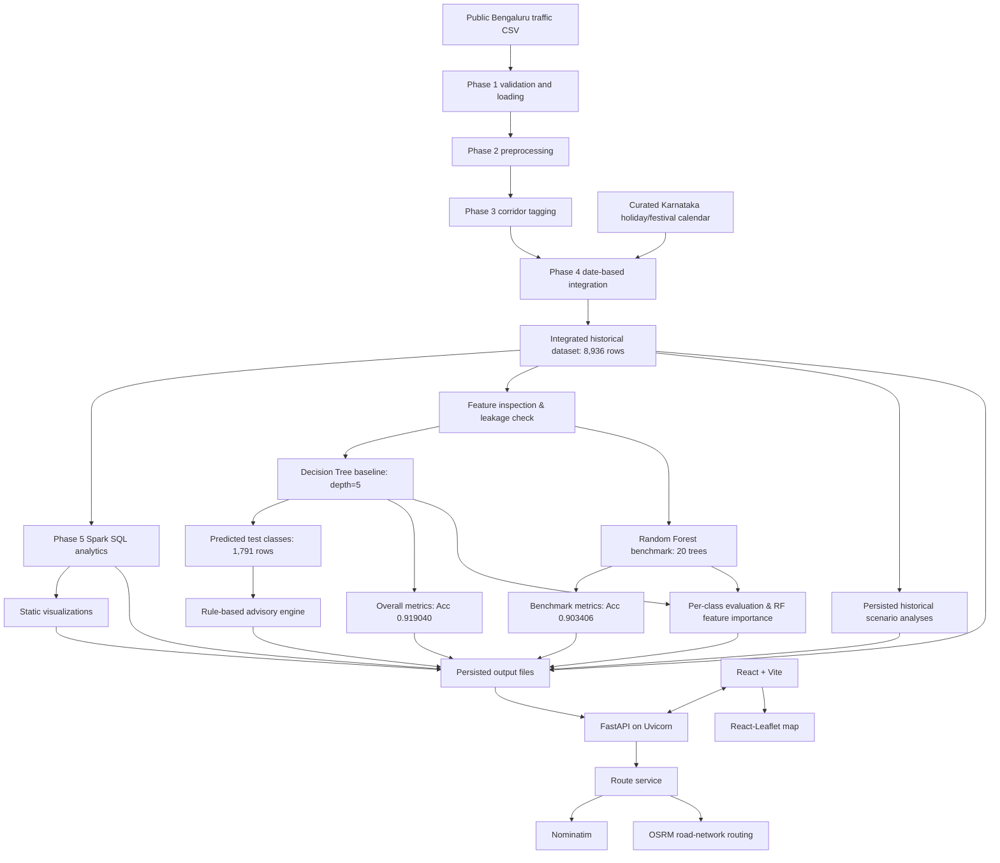

# Smart Mobility: A Big Data-Based Predictive Travel Congestion & Advisory System

## 1. Title

**Smart Mobility: A Big Data-Based Predictive Travel Congestion & Advisory System**

Detailed project title:

**Festival & Weekend Travel Surge Prediction and Traffic Advisory System: A Big Data Analytics Platform for Bengaluru**

## 2. Abstract

This project combines an offline historical analytics pipeline with a React/Vite browser application and FastAPI backend. The data pipeline loads a validated public traffic dataset, performs Spark preprocessing and corridor tagging, integrates a curated Karnataka holiday and festival calendar, and produces persisted Spark SQL summaries. It also performs historical congestion classification with a Spark MLlib Decision Tree baseline and evaluates a Random Forest benchmark on an identical chronological held-out test split. FastAPI serves route, persisted historical traffic, and persisted advisory endpoints to the React application. OSRM supplies road-network route geometry and estimates; the frontend renders maps with React-Leaflet.

The primary integrated dataset contains 8,936 records covering 2022-01-01 through 2024-08-09 across 16 corridors. The Decision Tree baseline and Random Forest benchmark use a chronological held-out test period from 2024-02-01 through 2024-08-09 containing 1,791 records. The validated test metrics are:
- **Decision Tree Baseline**: Accuracy 0.919040, Weighted Precision 0.919577, Weighted Recall 0.919040, F1 Score 0.919270.
- **Random Forest Benchmark**: Accuracy 0.903406, Weighted Precision 0.903470, Weighted Recall 0.903406, F1 Score 0.899209.

These values describe historical classification performance on the chronological held-out test set; they are not a claim of long-horizon future prediction or forecasting accuracy.

Historical traffic processing is batch-based. Route search uses external Nominatim and OSRM services, but the application does not provide live traffic monitoring, live GPS tracking, live FASTag processing, traffic-signal event processing, physical traffic-control automation, or route-to-historical-corridor matching.

## 3. Introduction

Urban congestion analysis requires reliable data preparation, consistent location identifiers, descriptive analytics, classification, and communication of results. This project organizes those activities into a phased pipeline for Bengaluru traffic records. The implementation emphasizes reproducibility, explicit provenance, target-leakage checks, deterministic advisory rules, and validation at each stage.

The project uses historical records at date-level granularity. It therefore supports historical congestion analysis and classification of observed congestion classes, but it does not implement hourly or real-time traffic operations.

## 4. Problem Statement

The project addresses the need to organize Bengaluru traffic records into a reproducible analytical workflow that can:

- prepare and validate historical traffic data;
- group observations by a transparent corridor identifier;
- compare congestion across corridors, day types, festivals, holidays, and days of the week;
- generate historical scenario comparisons across multiple contextual dimensions;
- classify observed congestion into Low, Medium, and High categories using machine learning;
- benchmark ensemble classification stability using Random Forest against the Decision Tree baseline;
- quantify per-class Precision, Recall, F1, and Support, and analyze grouped feature importance;
- translate predicted classes into transparent, rule-based traffic-management recommendations; and
- communicate validated historical findings through static charts and CSV-backed API responses.

The implemented system does not claim to control traffic infrastructure or make live operational decisions.

## 5. Objectives

The implemented objectives are:

1. Establish a primary real traffic data layer while preserving raw inputs.
2. Create standardized date-level analytical fields and congestion classes.
3. Generate deterministic corridor identifiers from observed location fields.
4. Integrate the curated Karnataka holiday and festival calendar without multiplying traffic rows.
5. Run Spark SQL descriptive analytics over the integrated data.
6. Inspect ML features and exclude fields that cause target leakage.
7. Train and evaluate a Decision Tree baseline using a chronological split.
8. Benchmark a Random Forest classifier using the same features and chronological split.
9. Provide granular per-class metrics and grouped feature importance visualization.
10. Implement an interactive Historical Scenario Analysis engine for contextual comparisons.
11. Generate prediction-based, rule-based advisories for the held-out test period.
12. Produce reproducible static visualizations.
13. Provide a React/Vite browser application backed by FastAPI for route comparison and historical traffic/advisory views.
14. Maintain Windows/Spark compatibility through portable JSON model specifications.
15. Validate all completed phases through automated and structural verification checks.

## 6. Scope

### Included

- Historical Bengaluru traffic CSV ingestion and validation.
- Spark-based preprocessing and corridor tagging.
- Date-level integration with the curated holiday/festival calendar.
- Spark SQL descriptive analytics.
- Spark MLlib Decision Tree baseline classification.
- Spark MLlib Random Forest benchmark classification.
- Per-class metric calculation (Precision, Recall, F1, Support) and grouped feature importance analysis.
- Persisted historical traffic and advisory views in the React application.
- Prediction-to-advisory processing for the chronological test period.
- Static matplotlib/seaborn visualizations.
- FastAPI endpoints for route search and persisted corridor traffic/advisory outputs.
- Comprehensive structural, data, artifact, backend API, and frontend validation.

### Excluded

The repository does not implement live traffic feeds, streaming traffic ingestion, validated GPS coordinates for historical corridors, historical-to-route geospatial matching, traffic direction, hourly observations, integrated FASTag/toll transactions, integrated traffic-signal event streams, physical deployment of personnel, automatic diversion activation, or automatic roadwork control. Route lookup does call the public Nominatim and OSRM services.

## 7. Existing System / Motivation

The repository is organized as a phased analytics project rather than as a pre-existing live traffic-control product. The motivation is to provide a traceable workflow from public historical traffic records to descriptive analysis, historical classification, and explainable recommendations for Bengaluru.

The project retains synthetic datasets for development/testing purposes, but the real traffic CSV is the primary traffic source. The curated holiday/festival calendar is used as a supplementary project input and is not described as an official government dataset.

## 8. Proposed System

The implemented proposed system is a batch pipeline:

1. Validate unchanged raw real and synthetic inputs.
2. Load the public Bengaluru traffic CSV with an explicit Spark schema.
3. Standardize reliable fields and derive date-level fields.
4. Derive `congestion_class` from `Congestion Level` using configured thresholds.
5. Add the composite `corridor` identifier.
6. Left-join the curated holiday/festival calendar on `date`.
7. Generate Spark SQL summaries.
8. Inspect ML features and remove leakage-prone fields.
9. Fit the Decision Tree baseline on the chronological training period.
10. Evaluate the Decision Tree model on the chronological test period.
11. Fit and evaluate the Random Forest benchmark on the identical chronological test period.
12. Compute per-class Precision, Recall, F1, and Support, and aggregate grouped feature importances.
13. Generate predicted classes and pass them to the rule-based advisory engine.
14. Create static charts and expose persisted corridor traffic/advisory outputs through FastAPI to the React application.

## 9. System Architecture



The analytics and ML pipeline is historical and batch-based. Browser requests read persisted traffic and advisory outputs through FastAPI; they do not run the Spark pipeline. Route search follows a separate request path through Nominatim and OSRM. Historical advisory data is not matched to OSRM route geometry.

## 10. Technologies Used

- **Python** (3.10+) for project modules, validation scripts, and local file handling.
- **PySpark** (3.5.x) for CSV loading, typed DataFrames, transformations, Spark SQL, and MLlib classification.
- **Spark SQL** for corridor, day-type, festival, holiday, day-of-week, and ranking summaries.
- **Spark MLlib** for `StringIndexer`, `OneHotEncoder`, `VectorAssembler`, `Pipeline`, `DecisionTreeClassifier`, `RandomForestClassifier`, and `MulticlassClassificationEvaluator`.
- **pandas** (2.x) for offline report and output processing.
- **matplotlib** and **seaborn** for static visualizations, confusion-matrix heatmaps, and horizontal feature-importance bar charts.
- **React** and **Vite** for the browser application.
- **Leaflet** and **React-Leaflet** for interactive route maps.
- **CSS and CSS Modules** for frontend styling; Tailwind is not configured in the frontend package.
- **FastAPI** and **Uvicorn** for the HTTP API and local ASGI server.
- **OpenStreetMap Nominatim** and **OSRM** for geocoding and road-network route calculations.
- **CSV, JSON, and Markdown** for project inputs, configuration, reports, portable model specifications, and documentation.

## 11. Dataset and Data Sources

### Primary traffic data

The primary source is `data/raw/real/Banglore_traffic_Dataset.csv`, described by the project as a validated public Bengaluru traffic dataset from Kaggle. The filename preserves the source spelling `Banglore`.

The raw traffic data contains 8,936 rows and covers 2022-01-01 through 2024-08-09. Its source fields include date, area, road/intersection, traffic volume, average speed, travel time index, congestion level, additional traffic indicators, weather, and roadwork.

### Curated holiday/festival calendar

`data/raw/real/karnataka_holidays_2022_2024.csv` contains 44 rows from 2022-01-15 through 2024-07-17. It contains `date`, `festival_name`, `festival_flag`, `holiday_flag`, and `source`.

This is curated project data based on published Karnataka Government holiday information. It is not presented as an official government dataset.

### Synthetic development data

The directory `data/raw/synthetic/` contains `traffic.csv`, `toll.csv`, `signal.csv`, and `festival_calendar.csv`. These files are retained for development/testing only. The synthetic toll and signal files are not official live transaction/event data and were not integrated with the real traffic records because compatible keys were unavailable.

Raw data is configured as immutable and was not modified by downstream phases.

## 12. Data Preprocessing

Phase 2 reads the real traffic CSV with an explicit Spark schema and writes `data/processed/real_traffic_preprocessed.csv`.

The preprocessing stage:

- converts the date to Spark `DateType` using `yyyy-MM-dd`;
- standardizes reliable source field names;
- derives `day_of_week` using Spark's numeric convention, Sunday `1` through Saturday `7`;
- derives `day_type` as `Weekend` for Saturday/Sunday and `Weekday` for Monday-Friday; and
- derives `congestion_class` from numeric `Congestion Level`.

The configured thresholds are:

- `Low`: `Congestion Level < 60`
- `Medium`: `60 <= Congestion Level < 90`
- `High`: `Congestion Level >= 90`

Missing-value handling preserves missing values. Rows are not dropped and values are not filled or replaced. In the validated outputs, the required processed fields were non-null.

## 13. Corridor Tagging

Phase 3 writes `data/processed/real_traffic_corridor_tagged.csv` and preserves the observed `area` and `road_intersection` fields.

The deterministic corridor rule is:

```text
corridor = area + " | " + road_intersection
```

The current data contains 8 areas, 16 road/intersection values, and 16 distinct area-road pairs/corridors. No direction, coordinates, GPS values, new road names, or semantic geographic mapping are invented.

## 14. Data Integration

Phase 4 uses `data/processed/real_traffic_corridor_tagged.csv` as the primary traffic input and joins the curated calendar using:

```text
traffic.date = calendar.date
```

The join is a left join. The curated calendar has exactly one row per date, so the integrated output preserves the 8,936 traffic rows.

The integrated output is `data/processed/integrated_traffic_data.csv` with these fields:

```text
date, area, road_intersection, corridor, traffic_volume,
average_speed, travel_time_index, congestion_level, congestion_class,
weather, roadwork, day_of_week, day_type, festival_flag,
festival_name, holiday_flag
```

The calendar supplies `festival_flag`, `festival_name`, and `holiday_flag`. Unmatched traffic dates receive false flags and a null festival name. Toll and signal datasets remain separate.

## 15. Spark SQL Analytics

Phase 5 registers the integrated DataFrame as the temporary SQL view `traffic_data` and executes analytical aggregations with `spark.sql(...)`.

The generated outputs are:

- `corridor_congestion_summary.csv`
- `high_congestion_corridors.csv`
- `day_type_congestion_summary.csv`
- `festival_congestion_summary.csv`
- `holiday_congestion_summary.csv`
- `day_of_week_congestion_summary.csv`
- `festival_corridor_analysis.csv`
- `top5_average_congestion_corridors.csv`
- `top5_high_congestion_percentage_corridors.csv`

The analyses calculate record counts, averages, congestion-class counts, high-congestion percentages, day-type comparisons, festival/holiday comparisons, festival-date corridor summaries, and analytical top-five rankings. The rankings are descriptive and do not label a corridor as universally best or worst.

Festival and holiday results describe observed historical differences. They do not establish causation.

## 16. Machine Learning

### 16.1 Feature Selection

Phase 6A inspected the integrated dataset before model training. The baseline and benchmark feature set consists of:

**Numeric (4 features):**
- `traffic_volume`
- `average_speed`
- `travel_time_index`
- `day_of_week`

**Categorical (6 features, 55 one-hot dimensions):**
- `corridor` (17 one-hot categories including handleInvalid)
- `area` (9 one-hot categories)
- `road_intersection` (17 one-hot categories)
- `weather` (6 one-hot categories)
- `roadwork` (3 one-hot categories)
- `day_type` (3 one-hot categories)

**Boolean (2 features):**
- `festival_flag`
- `holiday_flag`

Total vector assembly dimension: **61**.

### 16.2 Target Variable and Leakage Safeguards

The target is `congestion_class`, derived from numeric `Congestion Level` during preprocessing:
- `Low`: less than `60`
- `Medium`: from `60` inclusive to less than `90`
- `High`: `90` or greater

The validated integrated distribution across all 8,936 records is:
- Low: 1,947 records (21.7883%)
- Medium: 2,314 records (25.8953%)
- High: 4,675 records (52.3165%)

**Strict Leakage Safeguards:**
- `congestion_level` is **strictly excluded** from model inputs because `congestion_class` is derived directly from it; using it would cause trivial target leakage.
- `congestion_class` is the target column and is excluded from features.
- `festival_name` is excluded as a sparse calendar text label.
- Raw `date` strings are excluded to prevent temporal memorization.

### 16.3 Train-Test Strategy

The models use a strict chronological split rather than a random split to prevent temporal lookahead bias:
- **Training period**: 2022-01-01 to 2024-01-31 (7,145 records; ~80% of distinct dates).
- **Testing period**: 2024-02-01 to 2024-08-09 (1,791 records; ~20% of distinct dates).

The split ensures that training records strictly precede all testing records in time.

### 16.4 Decision Tree Classifier Baseline

The baseline uses Spark MLlib `DecisionTreeClassifier` inside a Spark `Pipeline`:
- Pipeline stages: 6 `StringIndexer` stages (one per categorical), 1 `OneHotEncoder`, 1 label `StringIndexer`, 1 `VectorAssembler` (61 dimensions), and `DecisionTreeClassifier`.
- Hyperparameters: `maxDepth = 5`, `seed = 42`, `labelCol = "label"`, `featuresCol = "features"`.
- Target label index mapping: `High = 0.0`, `Low = 1.0`, `Medium = 2.0`.

### 16.5 Decision Tree Evaluation

Evaluated using Spark MLlib `MulticlassClassificationEvaluator` on the chronological held-out test set (1,791 records):
- **Accuracy**: `0.919040`
- **Weighted Precision**: `0.919577`
- **Weighted Recall**: `0.919040`
- **Weighted F1 Score**: `0.919270`

Decision Tree test confusion matrix:
```text
actual_class,predicted_class,count
High,High,900
High,Medium,46
Low,Low,359
Low,Medium,31
Medium,High,44
Medium,Low,24
Medium,Medium,387
```

### 16.6 Random Forest Benchmark Model

In Phase 4, a Random Forest benchmark model was trained to empirically evaluate ensemble classification stability against the Decision Tree baseline using the identical 61-dimensional feature pipeline and identical chronological split:
- **Script**: `src/prediction/benchmark_random_forest.py`
- **Classifier**: Spark MLlib `RandomForestClassifier`
- **Hyperparameters**: `numTrees = 20`, `maxDepth = 5`, `seed = 42`
- **Evaluated Metrics (1,791 test records)**:
  - **Accuracy**: `0.903406`
  - **Weighted Precision**: `0.903470`
  - **Weighted Recall**: `0.903406`
  - **F1 Score**: `0.899209`

Random Forest test confusion matrix:
```text
actual_class,predicted_class,count
High,High,939
High,Medium,7
Low,Low,359
Low,Medium,31
Medium,High,110
Medium,Low,25
Medium,Medium,320
```

*Comparative Positioning*: The Random Forest is treated strictly as an empirical benchmark. Neither model is labeled "winner", "better", or "superior".

### 16.7 Per-Class Evaluation Breakdown

In Phase 5, per-class evaluation metrics were derived mathematically from the validated test confusion matrices for both models across all three classes (`High`, `Low`, `Medium`):

$$\text{Precision} = \frac{TP}{TP + FP}, \quad \text{Recall} = \frac{TP}{TP + FN}, \quad F1 = \frac{2 \cdot \text{Precision} \cdot \text{Recall}}{\text{Precision} + \text{Recall}}$$

Validated per-class values (1,791 total test support):

| Class | Model | Precision | Recall | F1 Score | Support |
| :--- | :--- | :--- | :--- | :--- | :--- |
| **High** | Decision Tree | 0.953390 | 0.951374 | 0.952381 | 946 |
| **High** | Random Forest | 0.895138 | 0.992600 | 0.941353 | 946 |
| **Low** | Decision Tree | 0.937337 | 0.920513 | 0.928849 | 390 |
| **Low** | Random Forest | 0.934896 | 0.920513 | 0.927649 | 390 |
| **Medium** | Decision Tree | 0.834052 | 0.850549 | 0.842220 | 455 |
| **Medium** | Random Forest | 0.893855 | 0.703297 | 0.787208 | 455 |

### 16.8 Random Forest Grouped Feature Importance

Feature importance values extracted from the Random Forest model ensemble were aggregated across one-hot sub-components into 12 logical feature groups:

| Rank | Feature Group | Gini Importance | Share (%) |
| :--- | :--- | :--- | :--- |
| 1 | `traffic_volume` | 0.502176 | 50.22% |
| 2 | `travel_time_index` | 0.193824 | 19.38% |
| 3 | `area` | 0.124284 | 12.43% |
| 4 | `road_intersection` | 0.066804 | 6.68% |
| 5 | `corridor` | 0.065991 | 6.60% |
| 6 | `average_speed` | 0.039955 | 4.00% |
| 7 | `weather` | 0.002407 | 0.24% |
| 8 | `day_type` | 0.001809 | 0.18% |
| 9 | `day_of_week` | 0.001328 | 0.13% |
| 10 | `festival_flag` | 0.000711 | 0.07% |
| 11 | `roadwork` | 0.000418 | 0.04% |
| 12 | `holiday_flag` | 0.000294 | 0.03% |
| **Total** | | **1.000001** | **100.00%** |

*Non-Causal Interpretation*: Feature importance indicates how the trained tree ensemble uses input variables for historical classification. It does not establish causation or physical traffic influence.

### 16.9 Windows Spark JSON Model-Specification Architecture

Native Spark `PipelineModel.save()` calls on Windows environments encounter Hadoop filesystem binary dependencies (`winutils.exe` and `NativeIO$Windows.access0`). 

To maintain full reproducibility across platforms:
- The project persists lightweight, portable JSON model specifications (`models/decision_tree_baseline/model_specification.json` and `models/random_forest_benchmark/model_specification.json`).
- These specifications contain:
  1. Exact classifier hyperparameters (`numTrees`, `maxDepth`, `seed`).
  2. Input data SHA-256 fingerprint for dataset validation.
  3. Preprocessing configuration (indexer string order, handleInvalid policies, label arrays).
  4. One-hot encoder category sizes.
  5. Chronological cutoff dates and row counts.
  6. Evaluated test-set metrics and grouped/vector feature importances.
- Downstream scoring pipelines reconstruct the pipeline deterministically using these specifications without requiring native binary model deserialization.

### 16.10 Nature of Classification Features

The model uses contemporaneous traffic variables (`traffic_volume`, `average_speed`, `travel_time_index`) to classify the congestion level of historical records. Therefore, the task is **batch historical classification on held-out test records**, not long-horizon time-series traffic forecasting.

## 17. Advisory Engine

Phase 7A implements a deterministic rule-based advisory engine in `src/advisory/advisory_engine.py`.

The congestion rules map congestion tiers to operational action sets:
- **Low Congestion** -> **Normal Advisory**: Routine monitoring, routine personnel, no special diversion or roadwork restriction.
- **Medium Congestion** -> **Moderate Advisory**: Increased monitoring, consider additional personnel, review diversion planning if congestion persists, review non-essential roadwork scheduling.
- **High Congestion** -> **High Advisory**: Deploy additional traffic personnel, prepare/activate suitable diversion planning, suspend or reschedule non-essential roadwork where operationally appropriate.

Context notes are appended when supported by row flags:
- `festival_flag = true`: Festival-related traffic conditions detected; strengthen traffic management preparedness.
- `holiday_flag = true`: Holiday-related traffic conditions detected; review expected travel demand.
- `roadwork = Yes`: Roadwork is present; review whether it can be postponed during high-congestion periods.
- `weather` in `Rain` or `Fog`: Adverse weather is present; consider additional caution and traffic monitoring.

The rules use advisory language ("recommended", "consider", "prepare", "review") and do not claim that personnel were dispatched or diversions enacted.

## 18. Prediction -> Advisory Pipeline

Phase 7B (`src/advisory/prediction_advisory_pipeline.py`) reconstructs the Decision Tree pipeline from the reproducible model specification and connects predictions to the advisory engine:
1. Loads the integrated dataset (8,936 rows).
2. Recreates the chronological split (7,145 train, 1,791 test).
3. Fits preprocessing and the Decision Tree classifier only on training data.
4. Generates predictions for the held-out test period (1,791 rows).
5. Passes `predicted_congestion_class` and contextual flags to the advisory rules. The historical `actual_congestion_class` is retained strictly for evaluation.

Validated test-period advisory distribution:
- Normal Advisory: 383 records
- Moderate Advisory: 464 records
- High Advisory: 944 records

Output file: `data/output/prediction_advisory_output.csv` (1,791 rows covering 2024-02-01 to 2024-08-09).

## 19. Visualizations

Phase 8A creates static charts using pandas, matplotlib, and seaborn, written to `data/output/visualizations/`:
- `congestion_class_distribution.png`
- `top5_average_congestion.png`
- `top5_high_congestion_percentage.png`
- `festival_vs_nonfestival.png`
- `weekday_vs_weekend.png`
- `actual_vs_predicted_confusion_matrix.png`
- `predicted_congestion_distribution.png`
- `advisory_distribution.png`

The charts are reproducible static views of validated batch outputs.

## 20. React + FastAPI Web Application

The current browser application is implemented in `frontend/` with React and Vite. The FastAPI application in `backend/app/main.py`, served locally with Uvicorn, exposes route, persisted traffic, and advisory endpoints.

### 20.1 Route Search and Map
- `RouteSearch.jsx` provides From/To fields, Nominatim-backed autocomplete, and route submission.
- The FastAPI route service reuses selected coordinates when supplied; otherwise, it resolves the entered location through Nominatim.
- The route service requests road-network route alternatives from OSRM and returns geometry, distance, and duration estimates.
- `RouteMap.jsx` renders route geometry using React-Leaflet; `RouteSummary.jsx` displays alternatives and the existing recommendation.
- OSRM duration and ranking do not represent live traffic or corridor-specific congestion.

### 20.2 Historical Corridor Analytics and Advisory
- `HistoricalTrafficIntelligence.jsx` requests corridor summaries, high-congestion corridor summaries, and temporal summaries from FastAPI.
- The historical advisory API reads `data/output/advisory_output.csv`; the UI presents persisted actions and context counts for the selected historical corridor.
- The backend APIs read validated persisted outputs. They do not start Spark for each request.
- No validated geographic mapping joins historical corridors to OSRM route geometry, so the historical view is explicitly not route-specific.

### 20.3 Reusable Frontend Components
- `TravelContextBar.jsx`, `RouteMetricsCard.jsx`, and `RouteAdvisoryCard.jsx` are present as reusable components but are not currently mounted in the main application or connected to route-specific congestion data.
- The adjusted time in `RouteMetricsCard` uses illustrative class multipliers; it is not an ML prediction and should not be presented as a forecast.
- `extractCorridorsFromOSRM.ts` is a helper, not an authoritative spatial-matching service. Its keyword matching and fallback cannot establish that an OSRM route traverses a historical corridor.

### 20.4 Separation from Offline Analytics
PySpark preprocessing, Spark SQL summaries, and model evaluation run as offline batch workflows. Their outputs are persisted under `data/output/` and served to the browser through FastAPI. Route geocoding/routing is a separate request path using public Nominatim and OSRM services.

## 21. Results Summary

### Integrated Data
- Total records: 8,936
- Date range: 2022-01-01 to 2024-08-09
- Corridors: 16 composite corridors across 8 areas
- Congestion classes: Low (1,947), Medium (2,314), High (4,675)

### Machine Learning Benchmark Results (Test Set: 1,791 rows)

| Metric | Decision Tree Baseline | Random Forest Benchmark |
| :--- | :--- | :--- |
| **Accuracy** | 0.919040 | 0.903406 |
| **Weighted Precision** | 0.919577 | 0.903470 |
| **Weighted Recall** | 0.919040 | 0.903406 |
| **F1 Score** | 0.919270 | 0.899209 |

### Per-Class Test Performance

| Class | Model | Precision | Recall | F1 Score | Support |
| :--- | :--- | :--- | :--- | :--- | :--- |
| **High** | Decision Tree | 0.953390 | 0.951374 | 0.952381 | 946 |
| **High** | Random Forest | 0.895138 | 0.992600 | 0.941353 | 946 |
| **Low** | Decision Tree | 0.937337 | 0.920513 | 0.928849 | 390 |
| **Low** | Random Forest | 0.934896 | 0.920513 | 0.927649 | 390 |
| **Medium** | Decision Tree | 0.834052 | 0.850549 | 0.842220 | 455 |
| **Medium** | Random Forest | 0.893855 | 0.703297 | 0.787208 | 455 |

### Prediction-Based Advisory Distribution
- Normal Advisory: 383 records (21.38%)
- Moderate Advisory: 464 records (25.91%)
- High Advisory: 944 records (52.71%)

## 22. Testing and Validation

All project phases have undergone rigorous verification:
- **Phase 9 Initial Audit**: 112 out of 112 checks passed across raw datasets, processed tables, ML specifications, advisory summaries, and static charts.
- **Phase 1 Validation**: Verified dynamic metric parsing without hardcoding; verified inclusive date filtering endpoints.
- **Phase 2 Validation**: Verified dataset columns confirm absence of GPS coordinates; validated no fabricated coordinates were added.
- **Phase 3 Validation**: Verified scenario filtering across all 6 controls and zero-record handling; confirmed no causal claims.
- **Phase 4 Validation**: Verified Random Forest script reproducibility, chronological split alignment, identical 61-dim feature vector, and non-zero benchmark metric parsing.
- **Phase 5 Validation**: Verified mathematical accuracy of per-class Precision, Recall, F1 calculations against test confusion matrices; verified feature importance schema, numeric validity, non-negativity, and sum = 1.000001.
- **Runtime Health**: The current web application exposes a FastAPI health endpoint at `/api/health`; the React frontend is served by Vite during local development.

## 23. Limitations

- **Batch Granularity**: Observations are aggregated at the date level; hourly fluctuations and peak vs. off-peak hours are not represented.
- **Not Real-Time**: The system performs offline batch processing; it does not connect to live sensors or GPS streams.
- **Not Time-Series Forecasting**: Machine learning models classify historical records using contemporaneous features; they do not predict future traffic time steps.
- **Absence of Validated Historical GPS Coordinates**: The primary traffic source has no validated coordinates for mapping historical corridors to route geometry. The separate route interface uses Nominatim-resolved endpoint coordinates.
- **Descriptive Scenario Explorer**: Differences observed in scenario analysis reflect historical correlations, not causal relationships.
- **Non-Causal Feature Importance**: Feature importance quantifies how tree splits separate historical classes; it does not indicate physical traffic causation.
- **Deterministic Advisory Heuristics**: Advisories are rule-based recommendations that do not model real-world municipal budgets, police staffing limits, or dynamic road closures.
- **Windows Spark Model Persistence**: Native Spark ML models cannot be persisted directly on Windows due to winutils limitations; reproducible JSON specifications are used instead.

## 24. Future Scope

Subject to acquiring authorized data and validated geospatial mappings:
- Mapping historical corridor records to verified GIS road segments for carefully scoped spatial analysis.
- Implementing sequential time-series forecasting (LSTM, Prophet) on high-frequency hourly sensor feeds.
- Ingesting real-time streaming traffic feeds using Apache Kafka and Spark Structured Streaming.
- Integrating GraphX / GraphFrames for corridor network connectivity and spillover congestion modeling.
- Developing mathematical optimization models for dynamic traffic personnel dispatch.

## 25. Conclusion

This project combines a reproducible historical analytics pipeline with a React/Vite frontend and FastAPI backend. PySpark, Spark SQL, and MLlib generate offline historical analytics and model outputs; FastAPI exposes route and persisted historical data services; React presents route comparison, map geometry, and historical corridor/advisory views. The route flow remains separate from historical corridor analytics.

## 26. Project Folder Structure

```text
BDA project/
├── config/
│   ├── corridor_mapping.json
│   ├── data_sources.json
│   ├── integration_config.json
│   └── preprocessing_config.json
├── backend/
│   └── app/
│       ├── main.py
│       ├── routes/
│       ├── schemas/
│       └── services/
├── dashboard/              # Older Python dashboard code retained in the repository
├── data/
│   ├── output/
│   │   ├── advisory_output.csv
│   │   ├── advisory_summary.txt
│   │   ├── corridor_congestion_summary.csv
│   │   ├── day_of_week_congestion_summary.csv
│   │   ├── day_type_congestion_summary.csv
│   │   ├── festival_congestion_summary.csv
│   │   ├── festival_corridor_analysis.csv
│   │   ├── high_congestion_corridors.csv
│   │   ├── holiday_congestion_summary.csv
│   │   ├── ml_baseline_evaluation.txt
│   │   ├── ml_model_benchmark.txt
│   │   ├── phase9_test_report.txt
│   │   ├── prediction_advisory_output.csv
│   │   ├── prediction_advisory_summary.txt
│   │   ├── top5_average_congestion_corridors.csv
│   │   ├── top5_high_congestion_percentage_corridors.csv
│   │   └── visualizations/
│   ├── processed/
│   │   ├── integrated_traffic_data.csv
│   │   ├── real_traffic_corridor_tagged.csv
│   │   └── real_traffic_preprocessed.csv
│   └── raw/
│       ├── real/
│       │   ├── Banglore_traffic_Dataset.csv
│       │   └── karnataka_holidays_2022_2024.csv
│       └── synthetic/
├── docs/
│   └── PROJECT_DOCUMENTATION.md
├── models/
│   ├── decision_tree_baseline/
│   │   └── model_specification.json
│   └── random_forest_benchmark/
│       └── model_specification.json
├── requirements.txt
├── frontend/
│   ├── package.json
│   └── src/
│       ├── App.jsx
│       ├── components/
│       └── utils/
├── src/
│   ├── advisory/
│   │   ├── advisory_engine.py
│   │   └── prediction_advisory_pipeline.py
│   ├── analytics/
│   │   └── spark_sql_analysis.py
│   ├── corridor/
│   │   └── tag_real_traffic_corridors.py
│   ├── ingestion/
│   │   ├── generate_synthetic_data.py
│   │   ├── integrate_data.py
│   │   ├── load_real_traffic_data.py
│   │   └── validate_real_traffic_data.py
│   ├── prediction/
│   │   ├── benchmark_random_forest.py
│   │   ├── feature_inspection.py
│   │   └── train_decision_tree.py
│   ├── preprocessing/
│   │   └── preprocess_real_traffic.py
│   ├── route/
│   │   ├── __init__.py
│   │   ├── geocoding.py
│   │   ├── map_view.py
│   │   └── routing.py
│   ├── spark_session.py
│   └── visualization/
│       └── create_visualizations.py
├── tests/
│   ├── __init__.py
│   ├── spark_smoke_test.py
│   └── test_smart_route.py
└── validation.txt
```

## 27. Route Search and Map (Nominatim + OSRM + React-Leaflet)

### 27.1 Module Purpose & Synopsis Alignment
The route-search feature provides road-network route comparison using OpenStreetMap Nominatim, OSRM, and React-Leaflet. Public services have usage and availability policies; the project does not claim guaranteed service levels or zero operating cost for arbitrary deployment.

The purpose of this module is **travel decision support**, not autonomous vehicular navigation or physical infrastructure control.

### 27.2 Architectural Boundary & Separation of Concerns
The system maintains a strict architectural division between historical batch analytics and the open-source route recommendation layer:

```
Historical traffic + calendar
          ↓
   PySpark / Spark SQL / MLlib
          ↓
   Persisted CSV outputs
          ↓
 FastAPI on Uvicorn ←─────────────┐
          ↕                       │
 React + Vite                     │
   ├── Historical corridor view   │
   ├── Historical advisory view   │
   └── React-Leaflet route map    │
                                  │
User From/To → Nominatim → FastAPI route service → OSRM
```

PySpark runs as an offline batch pipeline and writes persisted files. FastAPI serves these files for historical UI views and separately handles route requests. Route calculations do not consume or modify historical traffic data.

### 27.3 Open-Source Components Used
1. **OpenStreetMap Nominatim Geocoding**:
   - Resolves human-readable addresses (e.g., 'Koramangala, Bengaluru') to geographic coordinates (`lat, lon`).
   - Supports location search and geocoding for user-entered route endpoints.
2. **Open Source Routing Machine (OSRM)**:
   - Driving routing engine operating on OpenStreetMap road-network graphs (`http://router.project-osrm.org/route/v1/driving`).
   - Retrieves distance in meters, estimated duration in seconds, road summary descriptions, and full GeoJSON geometry (`geometries=geojson`).
   - Requests alternative candidates (`alternatives=true`) where road topology supports multiple paths.
3. **Leaflet & React-Leaflet**:
   - The React component `frontend/src/components/RouteMap.jsx` renders route polylines, origin/destination markers, and map tiles.
   - Route geometry and map bounds come from the returned route response.

### 27.4 Zero Cost & No API Keys
- **No Paid Cloud Account**: Requires no external cloud account, credit card, API key, or subscription.
- **Zero API Keys**: No API key lookup, environment variables, or secrets files are needed.
- **Free for Students and Researchers**: The entire routing stack is accessible out-of-the-box without financial barriers.

### 27.5 Public Routing Service Usage & Rate Limiting
- The module communicates with the public OSRM demo server and Nominatim API.
- Caching is implemented to eliminate redundant geocoding requests during user interaction.
- The public demo server is intended for limited exploratory usage; for high-throughput production, a self-hosted OSRM container can be deployed without code changes.

### 27.6 Transparent Recommendation Logic
The recommendation logic is completely deterministic and transparent:
1. Candidate routes returned by OSRM are sorted by 60-second duration buckets, then by physical travel distance.
2. This bucket-based rule is not a live congestion score or a pairwise assessment of route conditions.
3. The top route is marked **Recommended** with the exact time/distance comparison vs alternatives. Other paths are labeled **Alternative**.
4. When only one route exists, it is marked **Available Route** without claiming alternatives exist.
5. The recommendation is explicitly attributed to OSRM road-network calculations and is never conflated with Spark ML predictions.

### 27.7 Critical Data Integrity: No Live Traffic & Zero Coordinate Fabrication
- **No Live Traffic Feed**: Live/current traffic conditions and congestion overlays are **not** provided by this open-source implementation. OSRM calculates durations from static road-network topologies and default speed profiles. The system explicitly disclaims live traffic.
- **Zero Coordinate Fabrication**: The historical dataset records traffic observations across 16 composite corridors without GPS coordinates. The system **never** fabricates latitude/longitude values or attempts unvalidated spatial joins between OpenStreetMap coordinates and historical records.
- The React historical traffic panel states that its corridor data is not specific to the selected route because the project dataset does not contain a validated geographic mapping between route geometry and historical corridors.

### 27.8 Error Handling Matrix
The module handles all anticipated failure modes defensively:
- **Empty Inputs**: Validation prevents blank origin or destination queries.
- **Geocoding Failures**: Graceful error messages if Nominatim cannot resolve a location query.
- **OSRM Network Timeout / Errors**: Handled defensively with custom timeout limits (15s) and user-facing alerts.
- **No Drivable Routes**: Informs the user when no road connection exists between points.

## 28. Run the Web Application

The checked-in Windows layout has the Python virtual environment in the outer project directory and application source in the inner `BDA project` directory. Start the backend and frontend in separate PowerShell terminals.

### 1. Start the FastAPI backend

In Terminal 1:

```powershell
cd "C:\Users\shivr\Downloads\BDA project"
.\.venv\Scripts\Activate.ps1
python -m uvicorn backend.app.main:app --app-dir "C:\Users\shivr\Downloads\BDA project\BDA project" --reload --port 8000
```

If the outer virtual environment does not exist yet, create it and install backend/analytics dependencies:

```powershell
cd "C:\Users\shivr\Downloads\BDA project"
python -m venv .venv
.\.venv\Scripts\Activate.ps1
python -m pip install -r ".\BDA project\requirements.txt"
```

### 2. Start the React frontend

In Terminal 2:

```powershell
cd "C:\Users\shivr\Downloads\BDA project\BDA project\frontend"
npm install
npm run dev
```

### 3. Local URLs

- Frontend: `http://localhost:5173`
- FastAPI Swagger UI: `http://localhost:8000/docs`
- FastAPI health: `http://localhost:8000/api/health`

### 4. Optional offline analytics pipeline

Run these commands from the inner project directory with the Python environment active when regenerating persisted analytics/model outputs:

```powershell
# Step 1: Validate and ingest raw traffic data
python -m src.ingestion.validate_real_traffic_data

# Step 2: Preprocess raw traffic records
python -m src.preprocessing.preprocess_real_traffic

# Step 3: Tag composite corridors
python -m src.corridor.tag_real_traffic_corridors

# Step 4: Integrate with regional calendar
python -m src.ingestion.integrate_data

# Step 5: Execute Spark SQL descriptive analytics
python -m src.analytics.spark_sql_analysis

# Step 6: Train Decision Tree baseline
python -m src.prediction.train_decision_tree

# Step 7: Train Random Forest benchmark
python -m src.prediction.benchmark_random_forest

# Step 8: Generate predictions and rule-based advisories
python -m src.advisory.prediction_advisory_pipeline

# Step 9: Generate static visualization charts
python -m src.visualization.create_visualizations
```

## 28. Documentation Verification Checklist

- [x] No invented datasets
- [x] No invented metrics
- [x] No live-system claims
- [x] No target leakage
- [x] Actual model configurations used (DT depth=5, RF 20 trees)
- [x] Actual chronological test period documented (2024-02-01 to 2024-08-09, 1,791 rows)
- [x] Current React/FastAPI route and historical corridor views documented
- [x] Limitations documented (GPS, batch granularity, non-causal scenario/importance, contemporaneous features)
- [x] Synthetic data clearly labelled
- [x] Windows Spark model persistence limitation and JSON specification architecture documented
